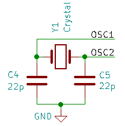

# pic32mxstart_code

「お手軽DIPマイコンのPIC32MXを始めよう(仮称)」のサンプルコードです。PIC32MX250F128BとHarmony3を用いています。

**第3章　環境構築**  
Ltika  
Lチカのコードです。正確にはLチカの3回目のコードです。  
  
**第4章　オシロスコープの製作**  
voltage_sender  
電圧値をUARTで送るコードで正確には2回目のほうです。
  
32MXOscillo, 32MXOscillo_overclock  
オシロスコープのコードです。
  
PWM_test  
コラムで紹介したArduinoのanalogWriteのような関数のサンプルプログラムです。32MXOscilloと同じく外部の16MHz水晶振動子を利用、OC1はRB3に割り当てています。抵抗とLEDを接続して光り方を見てみると良いと思います。
  
**第5章　ペリフェラル**  
SPItest_MCP4911  
SPI通信対応の10bitDACであるMCP4911と通信するコードです。
  
I2Ctest_AQM1602  
I2C通信タイプのキャラクタLCDであるAQM1602と通信するコードです。
  
**第6章　USB機器の開発**  
この章で扱う内容はMicrochipのUSBサンプルをベースとしています。  

USBhost_MSD, USBhost_MSD2  
USBメモリに対して書き込みを行うコードと読み込みと書き込みをすることでファイルを簡易コピーするコードです。  
  
USBdevice_HID_keyboard, USBdevice_HID_keyboard2(シークレット)  
USBキーボードのコードです。2のほうは同人誌で紹介していませんがこのページを閲覧した方へのボーナスコードで、扱っている内容はほとんど同じですが表示される文字が変更されています。  

USBdevice_CDC_comport  
(UARTはしていませんが)いわゆるUSBシリアル変換のコードです。  
  
# 本の訂正  
ここでページ数はページの下に書いてあるページ数の事とします。(pdf全体の番号では無い)  
  
**同人誌ver1.0**  
「第4章　オシロスコープの製作」においてclock configurationの設定を同人誌に貼り付けるのを忘れていました。(設定を行わなくても動作はしますが時間精度が悪くなります)  
→p167にある設定と同じ設定してください。

「第4章　オシロスコープの製作」の図4.5に水晶振動子およびコンデンサ2つが抜けておりました。OSC1,OSC2はそれぞれPIC32MXのピン9とピン10に対応します。

  